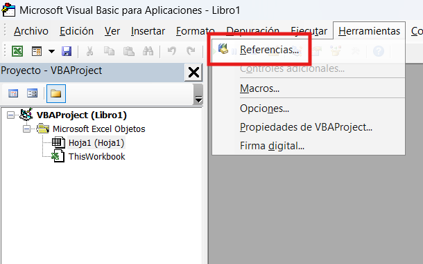
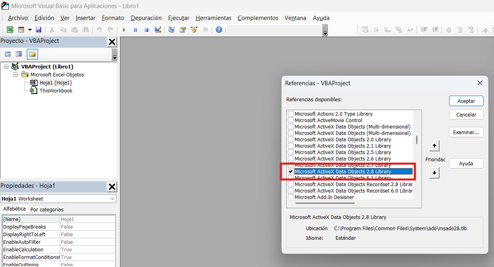

# Autor
Juan Felix Rodriguez Sanchez

# Proyecto
Sistema de VBA + SQL Server

# Descripción
Aplicación desarrollada en VBA con conexión a SQL Server mediante ADO

# Tecnologías
- VBA (Excel)
- SQL Server
- ADO

# Estructura
- /forms      -> Formularios VBA
- /modules    -> Módulos BAS
- /sql        -> Scripts SQL
- /docs       -> Documentación

# Implementación
- Paso 1: Descarga todos los recursos en una única carpeta
- Paso 2: Crear un archivo de Excel e ingresa al entorno de VBA
- Paso 3: Importa todos los recursos "forms" y "modules" en el proyecto de VBA
- Paso 4: Habilita la referencia mostrada
  

- Paso 5: Crea tu BD y la tabla Platos, importa en SQL Server el archivo de la carpeta "sql"
- Paso 6: Prueba la conexión desde VBA a Sql Server (especificando tu servidor y base de datos)
